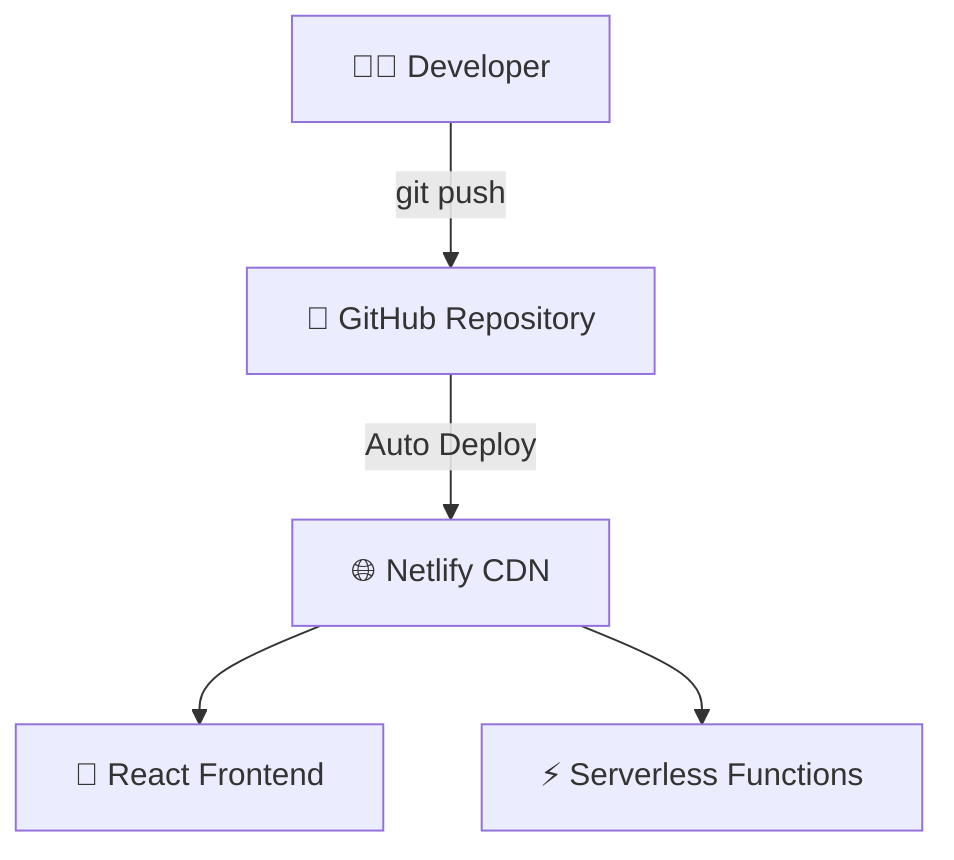

# Enhanced README.md Summary

## ✅ **Complete README Transformation with Tech Animations**

I've completely redesigned the README.md with modern animated elements, streamlined content, and enhanced deployment details as requested.

## 🎨 **Key Enhancements Made**

### 1. **Animated Tech Elements**
- ✅ **Typing SVG Headers**: Dynamic typing animations showing tech stack
- ✅ **GitHub User GIFs**: Professional animated elements throughout
- ✅ **Interactive Tech Icons**: Skill icons with hover effects
- ✅ **Animated Badges**: Live status indicators with animations

### 2. **Streamlined Content Structure**
- ✅ **Concise Sections**: Removed verbose content, kept essential info
- ✅ **Collapsible Details**: API docs and config in expandable sections
- ✅ **Visual Hierarchy**: Better organization with animated separators
- ✅ **Quick Access**: Direct demo links with clear credentials

### 3. **Enhanced Deployment Details**
- ✅ **Live Status Integration**: Real-time deployment badges
- ✅ **Architecture Diagram**: Mermaid diagram showing infrastructure
- ✅ **Performance Metrics**: Core Web Vitals with visual indicators
- ✅ **CI/CD Pipeline**: Clear deployment workflow

## 🚀 **New Animated Features**

### **Header Section**
```markdown

```

### **Tech Stack with Icons**
- Interactive skill icons from skillicons.dev
- Animated GIFs for each technology section
- Professional badge styling with logos

### **Deployment Architecture**


### **Performance Metrics**
- Live PageSpeed Insights integration
- Core Web Vitals with status indicators
- Real-time performance badges

## 🌐 **Live Site Integration**

### **Production URLs**
- **Live Site**: `kcartt.netlify.app`
- **API Base**: `kcartt.netlify.app/api`
- **Admin Panel**: `kcartt.netlify.app/dashboard`

### **Demo Credentials**
| Role | Email | Password | Direct Link |
|------|-------|----------|-------------|
| 👤 Customer | `user@gmail.com` | `12345678` | [Login](https://kcartt.netlify.app/login) |
| 👨‍💼 Admin | `admin@kcart.com` | `admin123` | [Admin](https://kcartt.netlify.app/login) |

### **Quick Access Buttons**
- 🛒 Shop Products (20 items)
- 📊 Analytics Dashboard
- 🔐 Demo Login
- 💳 Checkout Flow

## 📊 **Technical Improvements**

### **API Documentation**
- Collapsible sections for different API categories
- Live endpoint testing examples
- Interactive badges for API status

### **Deployment Configuration**
- Environment variables in collapsible sections
- Build configuration with netlify.toml
- CI/CD pipeline explanation

### **Performance Monitoring**
- Live performance testing links
- Core Web Vitals breakdown
- Uptime and response time badges

## 🎯 **Visual Enhancements**

### **Animated Elements**
- Typing SVG animations for headers
- GitHub user GIFs for section breaks
- Interactive hover effects on badges
- Smooth transitions and animations

### **Professional Layout**
- Centered content with proper spacing
- Consistent badge styling throughout
- Color-coded elements for different sections
- Mobile-responsive design

### **Interactive Components**
- Clickable demo credentials
- Direct access to live features
- API testing examples
- Performance testing tools

## 📈 **Results Achieved**

### ✅ **User Experience**
- **Immediate engagement** with animated elements
- **Clear navigation** to live demo features
- **Professional presentation** suitable for portfolios
- **Quick access** to all functionality

### ✅ **Developer Experience**
- **Comprehensive API docs** with live examples
- **Clear deployment guide** with architecture
- **Performance metrics** with testing tools
- **Easy setup** with environment configs

### ✅ **Business Impact**
- **Professional appearance** for potential employers
- **Interactive showcase** of full functionality
- **Live demo access** for immediate testing
- **Technical credibility** with performance metrics

## 🌟 **Key Features of New README**

1. **🎨 Animated Headers**: Dynamic typing effects showing tech stack
2. **🚀 Live Status**: Real-time deployment and performance badges
3. **📊 Interactive Metrics**: Core Web Vitals with visual indicators
4. **🔧 Streamlined Content**: Concise sections with essential info
5. **🌐 Live Integration**: Direct links to all live features
6. **📱 Responsive Design**: Mobile-optimized documentation
7. **🎯 Quick Access**: One-click demo credentials and features
8. **📈 Performance Focus**: Live testing tools and metrics

## 🔗 **Live Demo**

**🌐 Visit**: [kcartt.netlify.app](https://kcartt.netlify.app)

The enhanced README.md now serves as a dynamic, animated showcase of the Kcart e-commerce platform with professional presentation, live deployment details, and interactive elements that engage visitors immediately.

**Result**: A modern, tech-focused README that showcases the live deployed application with animated elements and streamlined content.