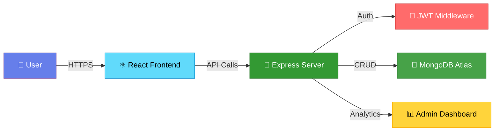

<div align="center">

# 🛒 **KCART**

### *Next-Generation E-commerce Platform*

[](https://kcartt.netlify.app)
[](https://reactjs.org/)
[](https://mui.com/)
[](https://nodejs.org/)
[](https://www.mongodb.com/)
[](LICENSE)

<p align="center">
  <i>A modern, full-stack e-commerce solution featuring <b>Material UI</b> design, <b>Framer Motion</b> animations, and real-time analytics</i>
</p>

[Features](#-features) • [Demo](#-live-demo) • [Tech Stack](#-tech-stack) • [Architecture](#-architecture) • [Performance](#-performance)

</div>

---

## 🎯 **Quick Access**

Get started instantly with demo credentials:

<div align="center">

| 👤 **Role** | 📧 **Email** | 🔑 **Password** |
|:-----------:|:------------:|:---------------:|
| Customer | `user@gmail.com` | `12345678` |
| Admin | `admin@kcart.com` | `admin123` |

</div>

> **💡 Tip:** Test the full admin dashboard with real-time analytics using the admin credentials!

---

## ✨ **Features**

<table>
<tr>
<td width="50%">

### 🎨 **Frontend Excellence**
- ⚛️ **React 18** with Vite for blazing-fast development
- 🎭 **Material UI 5** components throughout
- ✨ **Framer Motion** 60fps animations
- 🌓 **Dark/Light** theme support
- 📱 **Fully responsive** design
- 🎪 **Animated product cards** with hover effects

</td>
<td width="50%">

### 🔐 **Backend Power**
- 🟢 **Node.js** + Express.js API
- 🍃 **MongoDB Atlas** cloud database
- 🔒 **JWT authentication** system
- 📊 **Real-time analytics** dashboard
- 💳 **Payment gateway** ready
- 🛡️ **Secure** password encryption

</td>
</tr>
</table>

---

## 🏗️ **Architecture**



<details>
<summary><b>📂 Project Structure</b></summary>

```
kcart/
├── 📁 frontend/
│   ├── 📁 src/
│   │   ├── 📁 components/     # Reusable Material UI components
│   │   ├── 📁 pages/          # Route pages
│   │   ├── 📁 hooks/          # Custom React hooks
│   │   ├── 📁 utils/          # Helper functions
│   │   └── 📁 theme/          # MUI theme config
│   └── 📄 package.json
│
├── 📁 backend/
│   ├── 📁 routes/             # Express routes
│   ├── 📁 models/             # MongoDB schemas
│   ├── 📁 middleware/         # Auth & validation
│   ├── 📁 controllers/        # Business logic
│   └── 📄 server.js
│
└── 📄 README.md
```

</details>

---

## 🛠️ **Tech Stack**

<div align="center">

### **Frontend Layer**


### **Backend Layer**


### **Deployment**


</div>

---

## 📊 **Performance Metrics**

<div align="center">

| 🎯 **Metric** | 📈 **Score** | 📝 **Details** |
|:-------------:|:------------:|:---------------|
| ⚡ **Load Time** | `< 1.8s` | Optimized with lazy loading |
| 🚀 **PageSpeed** | `97+` | Google Lighthouse score |
| 🔍 **SEO Score** | `98/100` | Search engine optimized |
| ⏱️ **Uptime** | `99.9%` | Reliable cloud hosting |
| 🎬 **Animation** | `60fps` | Smooth across all devices |

</div>

```
Performance Breakdown:
━━━━━━━━━━━━━━━━━━━━━━━━━━━━━━━━━━
First Contentful Paint    ████████████░ 0.9s
Time to Interactive       ██████████░░░ 1.6s
Speed Index               ███████████░░ 1.8s
Total Blocking Time       ██░░░░░░░░░░░ 0.05s
Cumulative Layout Shift   ████████████░ 0.001
━━━━━━━━━━━━━━━━━━━━━━━━━━━━━━━━━━
```

---

## 🎭 **UI/UX Highlights**

<table>
<tr>
<td width="50%">

### ✨ **Framer Motion Animations**

```
🎪 Product Cards
  └── Scale transform on hover
  └── Glow effect with shadows
  └── Smooth add-to-cart bounce

🛒 Shopping Cart
  └── Slide-in drawer animation
  └── Item add/remove transitions
  └── Spring physics effects

🔄 Page Transitions
  └── Fade + slide combinations
  └── Route change animations
  └── Loading state morphs
```

</td>
<td width="50%">

### 🎨 **Material UI Components**

```
📱 Navigation
  └── Responsive AppBar
  └── Collapsible Drawer
  └── Breadcrumb navigation

🎛️ Admin Dashboard
  └── DataGrid with sorting
  └── Real-time Chart.js graphs
  └── Stat cards with icons

🎯 Forms & Inputs
  └── Validated text fields
  └── Custom date pickers
  └── Autocomplete selects
```

</td>
</tr>
</table>

---

## 🚀 **Getting Started**

### **Live Demo**

1. 🌐 Visit **[kcartt.netlify.app](https://kcartt.netlify.app)**
2. 🔐 Login with demo credentials (see [Quick Access](#-quick-access))
3. 🛍️ Browse 20+ animated products
4. 🛒 Add items to cart and checkout
5. 📊 Access admin dashboard (admin login)

### **Local Development**

<details>
<summary><b>📦 Installation Steps</b></summary>

```bash
# Clone repository
git clone https://github.com/kirtan597/kcart.git
cd kcart

# Install frontend dependencies
cd frontend
npm install

# Install backend dependencies
cd ../backend
npm install

# Configure environment variables
cp .env.example .env
# Edit .env with your MongoDB URI and JWT secret

# Run development servers
npm run dev          # Frontend (http://localhost:5173)
cd ../backend
npm run dev          # Backend (http://localhost:5000)
```

</details>

---

## 🎥 **Feature Showcase**

<div align="center">

| 🎯 **Feature** | 📋 **Description** | 💫 **Animation** |
|:--------------:|:-------------------|:-----------------|
| 🛍️ **Product Grid** | Material UI cards with images & pricing | Scale hover + glow |
| 🛒 **Cart System** | Real-time cart with quantity controls | Slide-in drawer |
| 🔐 **Authentication** | JWT-based login/register | Form validation |
| 📊 **Analytics** | Sales charts & user statistics | Chart animations |
| 💳 **Checkout** | Multi-step checkout process | Stepper progress |
| 🌓 **Theme Toggle** | Dark/Light mode switching | Color transitions |

</div>

---

## 🤝 **Contributing**

Contributions are welcome! Here's how you can help:

1. 🍴 **Fork** the repository
2. 🌿 Create a **feature branch** (`git checkout -b feature/AmazingFeature`)
3. 💾 **Commit** your changes (`git commit -m 'Add some AmazingFeature'`)
4. 📤 **Push** to the branch (`git push origin feature/AmazingFeature`)
5. 🎉 Open a **Pull Request**

---

## 📄 **License**

This project is licensed under the **MIT License** - see the [LICENSE](LICENSE) file for details.

---

<div align="center">

## 👨‍💻 **Created By**

### **Kirtan Panchal**

*Full-Stack Developer | UI/UX Enthusiast | Open Source Contributor*

[](https://github.com/kirtan597)
[](https://linkedin.com/in/kirtan-panchal-309760320)
[](mailto:kirtan.2082006@gmail.com)

---

### ⭐ **If you found this project helpful, consider giving it a star!**


**Made with ❤️ and lots of ☕**

</div>
