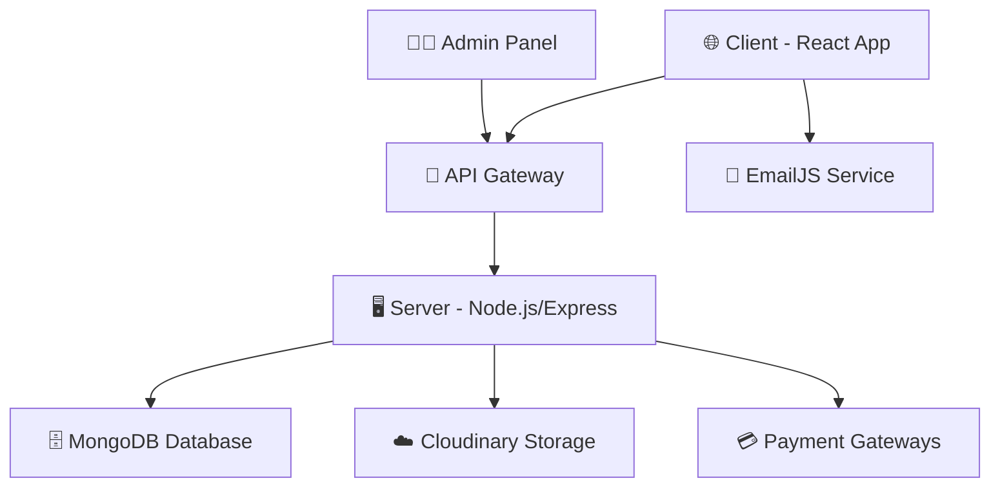

<div align="center">

# 🛒 **Kcart** - Modern E-Commerce Platform


[](https://reactjs.org/)
[](https://nodejs.org/)
[](https://mongodb.com/)
[](https://tailwindcss.com/)


</div>

## 🌟 **Features Overview**

<div align="center">

### 🎯 **Core Features**
| Feature | Description | Status |
|---------|-------------|--------|
| 🏠 **Modern Homepage** | Hero carousel, latest collections, best sellers | ✅ |
| 🛍️ **Product Catalog** | Advanced filtering, search, categories | ✅ |
| 🛒 **Shopping Cart** | Add/remove items, quantity management | ✅ |
| 💳 **Secure Checkout** | Multiple payment gateways integration | ✅ |
| 👤 **User Authentication** | Login, register, password reset | ✅ |
| 📱 **Responsive Design** | Mobile-first, cross-device compatibility | ✅ |
| 📧 **Contact System** | EmailJS integration for inquiries | ✅ |
| 🎨 **Black & White Theme** | Modern, clean aesthetic design | ✅ |

</div>

---

## 🚀 **Tech Stack**

<div align="center">

### **Frontend Arsenal**


### **Backend Powerhouse**  


### **Development Tools**


</div>

### 📦 **Dependencies Breakdown**

#### **Client Side**
```json
{
  "🎨 UI/UX": ["@mui/material", "tailwindcss", "react-icons", "lucide-react"],
  "🔄 State & Routing": ["react-router-dom", "axios"],
  "✨ Animations": ["lenis", "swiper"],
  "📧 Communication": ["@emailjs/browser", "react-toastify"],
  "⚡ Build Tools": ["vite", "@vitejs/plugin-react"]
}
```

#### **Server Side**
```json
{
  "🔐 Security": ["bcrypt", "jsonwebtoken", "validator"],
  "🗄️ Database": ["mongoose"],
  "💳 Payments": ["stripe", "razorpay"],
  "📧 Email": ["nodemailer"],
  "☁️ Storage": ["cloudinary", "multer"],
  "🌐 Server": ["express", "cors", "dotenv"]
}
```

---

## 🏗️ **Project Architecture**

<div align="center">



</div>

### 📁 **Folder Structure**
```
📦 Kcart E-Commerce
├── 🎨 client/          # React Frontend
│   ├── 📄 src/pages/   # Page components
│   ├── 🧩 src/components/ # Reusable components
│   └── 🎯 src/context/ # State management
├── 🖥️ server/          # Node.js Backend
│   ├── 🛣️ routes/      # API endpoints
│   ├── 📊 models/      # Database schemas
│   └── 🔧 controllers/ # Business logic
└── 👨‍💼 admin/          # Admin Dashboard
    └── 📊 Management interface
```

---

## 🎨 **Design Philosophy**

<div align="center">

### **Black & White Minimalism**


**🎯 Design Principles:**
- ⚫ **Shiny Black** accents for premium feel
- ⚪ **Clean White** backgrounds for clarity  
- 🎨 **Minimalist** approach for better UX
- 📱 **Mobile-first** responsive design
- ✨ **Smooth animations** and transitions

</div>

---

## 🚀 **Quick Start Guide**

### 📋 **Prerequisites**
```bash
Node.js >= 18.0.0
npm >= 9.0.0
MongoDB >= 6.0.0
```

### ⚡ **Installation**

<details>
<summary>🔧 <strong>Step-by-step Setup</strong></summary>

#### 1️⃣ **Clone Repository**
```bash
git clone https://github.com/yourusername/kcart-ecommerce.git
cd kcart-ecommerce
```

#### 2️⃣ **Install Dependencies**
```bash
# Install all dependencies at once
./install-all.bat

# Or install individually:
cd client && npm install
cd ../server && npm install  
cd ../admin && npm install
```

#### 3️⃣ **Environment Setup**
```bash
# Client (.env)
VITE_BACKEND_URL=http://localhost:4000

# Server (.env)
MONGODB_URI=your_mongodb_connection_string
JWT_SECRET=your_jwt_secret_key
CLOUDINARY_NAME=your_cloudinary_name
CLOUDINARY_API_KEY=your_cloudinary_api_key
CLOUDINARY_API_SECRET=your_cloudinary_api_secret
STRIPE_SECRET_KEY=your_stripe_secret_key
RAZORPAY_KEY_ID=your_razorpay_key_id
RAZORPAY_KEY_SECRET=your_razorpay_key_secret
ADMIN_EMAIL=admin@kcart.com
ADMIN_PASSWORD=admin123
```

#### 4️⃣ **Launch Application**
```bash
# Start all services
./start-demo.bat

# Or start individually:
cd server && npm run server    # Backend on :4000
cd client && npm run dev       # Frontend on :5173  
cd admin && npm run dev        # Admin on :5174
```

</details>

---

## 🌟 **Key Features Showcase**

<div align="center">

### 🏠 **Homepage Experience**
- 🎠 **Dynamic Hero Carousel** with smooth transitions
- 🏷️ **Brand Carousel** with promotional offers
- 🆕 **Latest Collections** showcase
- 🔥 **Best Sellers** section
- 📱 **App Download** promotion

### 🛍️ **Shopping Experience**  
- 🔍 **Advanced Search** with filters
- 📱 **Product Gallery** with zoom functionality
- 🛒 **Smart Cart** management
- 💳 **Secure Checkout** process
- 📦 **Order Tracking** system

### 👤 **User Management**
- 🔐 **Secure Authentication** with JWT
- 👤 **Profile Management** 
- 📧 **Email Verification**
- 🔑 **Password Reset** functionality
- 📋 **Order History**

### 📧 **Communication**
- 📬 **Contact Form** with EmailJS
- 🗺️ **Interactive Map** (Satellite view)
- 📱 **Social Media** integration
- 💬 **Real-time Notifications**

### 👨‍💼 **Admin Dashboard**
- 📊 **Analytics Dashboard**
- 📦 **Product Management** (CRUD)
- 👥 **User Management**
- 📋 **Order Management**
- 💰 **Sales Reports**

</div>

---

## 🎯 **API Endpoints**

<details>
<summary>📡 <strong>Backend API Routes</strong></summary>

### 🔐 **Authentication**
```
POST /api/user/register     # User registration
POST /api/user/login        # User login  
POST /api/user/admin        # Admin login
POST /api/user/forgot       # Password reset
```

### 🛍️ **Products**
```
GET  /api/product/list      # Get all products
GET  /api/product/:id       # Get single product
POST /api/product/add       # Add product (Admin)
POST /api/product/remove    # Remove product (Admin)
```

### 🛒 **Cart & Orders**
```
POST /api/cart/add          # Add to cart
POST /api/cart/update       # Update cart
POST /api/cart/get          # Get cart items
POST /api/order/place       # Place order
POST /api/order/stripe      # Stripe payment
POST /api/order/razorpay    # Razorpay payment
```

</details>

---

## 🌐 **Live Demo**

<div align="center">

### 🚀 **Experience Kcart Live**
[](https://e-commerce-website-4w6a.vercel.app)

### 🧪 **Test Credentials**
```
👤 User Account:
Email: user@gmail.com
Password: 12345678

👨‍💼 Admin Account:
Email: admin@kcart.com  
Password: admin123
```

</div>

---

## 🎨 **Screenshots & Demo**

<div align="center">

### 🖥️ **Desktop Experience**


### 📱 **Mobile Responsive**  


</div>

---

## 🔮 **Future Enhancements**

<div align="center">

| Feature | Priority | Status |
|---------|----------|--------|
| 🌟 **Product Reviews & Ratings** | High | 🔄 Planning |
| 💝 **Wishlist Functionality** | High | 🔄 Planning |
| 🎫 **Coupon & Discount System** | Medium | 🔄 Planning |
| 📧 **Email Notifications** | Medium | 🔄 Planning |
| 📱 **Progressive Web App (PWA)** | Low | 🔄 Planning |
| 🔔 **Push Notifications** | Low | 🔄 Planning |

</div>

---

## 🤝 **Contributing**

<div align="center">


### **We Welcome Contributions!**

</div>

1. 🍴 **Fork** the repository
2. 🌿 **Create** your feature branch (`git checkout -b feature/AmazingFeature`)
3. 💾 **Commit** your changes (`git commit -m 'Add some AmazingFeature'`)
4. 📤 **Push** to the branch (`git push origin feature/AmazingFeature`)
5. 🔄 **Open** a Pull Request

---

## 📄 **License**

<div align="center">

This project is licensed under the **MIT License** - see the [LICENSE](LICENSE) file for details.

### 👨‍💻 **Developer**

**Kirtan Panchal**  
[](https://www.linkedin.com/in/kirtan-panchal-309760320/)
[](https://github.com/kirtan597)
[](mailto:kirtan.2082006@gmail.com)

---


### ⭐ **If you found this project helpful, please give it a star!** ⭐


</div>