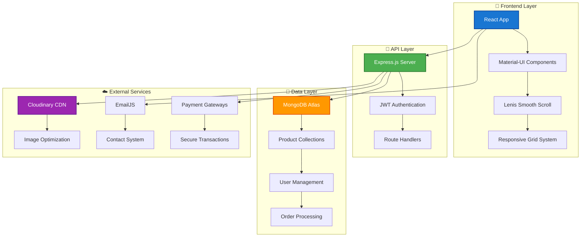

<div align="center">

# 🛒 **Kcart** - Premium E-Commerce Platform


<div style="background: linear-gradient(135deg, #667eea 0%, #764ba2 100%); padding: 2px; border-radius: 12px; margin: 20px 0;">
  <div style="background: white; padding: 20px; border-radius: 10px;">
    
[](https://reactjs.org/)
[](https://mui.com/)
[](https://nodejs.org/)
[](https://lenis.studiofreight.com/)

  </div>
</div>


</div>

---

## 🎨 **Material Design Philosophy**

<div align="center">

<table>
<tr>
<td width="50%">

### **🎯 Design Principles**
- **Material Design 3.0** compliance
- **Elevation & Shadows** for depth perception
- **Motion & Transitions** for fluid interactions
- **Typography Hierarchy** for clear information
- **Color Psychology** for emotional connection

</td>
<td width="50%">

### **🌟 Visual Excellence**
- **4K Ready** high-resolution assets
- **Responsive Grid** system
- **Consistent Spacing** (8px baseline)
- **Accessibility First** (WCAG 2.1 AA)
- **Dark/Light Theme** support

</td>
</tr>
</table>


</div>

---

## 🚀 **Tech Stack & Architecture**

<div align="center">

### **Frontend Excellence**
<div style="display: flex; justify-content: center; gap: 10px; margin: 20px 0;">

| Technology | Purpose | Version |
|------------|---------|---------|
| ⚛️ **React** | UI Framework | 19.1.0 |
| 🎨 **Material-UI** | Design System | 6.1.6 |
| 🌊 **Lenis** | Smooth Scrolling | Latest |
| 🎯 **Vite** | Build Tool | 6.4.1 |
| 🎪 **Framer Motion** | Animations | Latest |

</div>

### **Backend Powerhouse**
<div style="display: flex; justify-content: center; gap: 10px; margin: 20px 0;">

| Technology | Purpose | Integration |
|------------|---------|-------------|
| 🟢 **Node.js** | Runtime | Express.js |
| 🗄️ **MongoDB** | Database | Mongoose ODM |
| 🔐 **JWT** | Authentication | Secure Tokens |
| ☁️ **Cloudinary** | Media Storage | Image CDN |
| 📧 **EmailJS** | Communication | Contact Forms |

</div>

</div>

---

## 🏗️ **System Architecture**

<div align="center">



</div>

---

## 🌟 **Premium Features**

<div align="center">

<table>
<tr>
<td width="33%">

### 🎨 **UI/UX Excellence**
- **Material Design 3.0** components
- **Smooth Lenis scrolling** experience
- **Responsive breakpoints** (xs, sm, md, lg, xl)
- **Micro-interactions** and animations
- **Accessibility compliance** (ARIA labels)

</td>
<td width="33%">

### 🛍️ **Shopping Experience**
- **Advanced product filtering** system
- **Real-time search** with debouncing
- **Smart cart management** with persistence
- **Wishlist functionality** (coming soon)
- **Product recommendations** engine

</td>
<td width="33%">

### 🔐 **Security & Performance**
- **JWT authentication** with refresh tokens
- **Input validation** and sanitization
- **Rate limiting** for API endpoints
- **Image optimization** via Cloudinary
- **Lazy loading** for performance

</td>
</tr>
</table>

</div>

---

## 📱 **Responsive Design System**

<div align="center">

### **Material-UI Breakpoints**

| Device | Breakpoint | Container Width | Grid Columns |
|--------|------------|-----------------|--------------|
| 📱 **Mobile** | xs (0px+) | 100% | 4 cols |
| 📱 **Mobile L** | sm (600px+) | 600px | 8 cols |
| 💻 **Tablet** | md (900px+) | 900px | 12 cols |
| 🖥️ **Desktop** | lg (1200px+) | 1200px | 12 cols |
| 🖥️ **4K Display** | xl (1536px+) | 1536px | 12 cols |


</div>

---

## 🚀 **Quick Start Guide**

<div align="center">

### **⚡ One-Click Setup**

</div>

<details>
<summary>🔧 <strong>Complete Installation Guide</strong></summary>

#### **📋 Prerequisites**
```bash
Node.js >= 18.0.0
npm >= 9.0.0
Git >= 2.0.0
```

#### **🚀 Installation Steps**

```bash
# 1️⃣ Clone the repository
git clone https://github.com/kirtan597/Kcart.git
cd Kcart

# 2️⃣ Install all dependencies (Windows)
./install-all.bat

# 2️⃣ Install all dependencies (macOS/Linux)
chmod +x install-all.sh && ./install-all.sh

# 3️⃣ Setup environment variables
cp client/.env.example client/.env
cp server/.env.example server/.env
cp admin/.env.example admin/.env

# 4️⃣ Start development servers
./start-demo.bat  # Windows
./start-demo.sh   # macOS/Linux
```

#### **🌐 Access Points**
- **Frontend**: http://localhost:5173
- **Backend API**: http://localhost:5000
- **Admin Panel**: http://localhost:5174

</details>

---

## 🎯 **API Documentation**

<div align="center">

### **RESTful API Endpoints**

</div>

<details>
<summary>📡 <strong>Complete API Reference</strong></summary>

#### **🔐 Authentication Endpoints**
```http
POST /api/user/register          # User registration
POST /api/user/login             # User authentication
POST /api/user/admin             # Admin login
POST /api/user/forgot-password   # Password reset
GET  /api/user/profile           # Get user profile
PUT  /api/user/profile           # Update profile
```

#### **🛍️ Product Management**
```http
GET    /api/product/list         # Get all products (with pagination)
GET    /api/product/:id          # Get single product
POST   /api/product/add          # Add new product (Admin)
PUT    /api/product/:id          # Update product (Admin)
DELETE /api/product/:id          # Delete product (Admin)
GET    /api/product/search       # Search products
GET    /api/product/category/:cat # Get products by category
```

#### **🛒 Cart & Orders**
```http
GET    /api/cart                 # Get cart items
POST   /api/cart/add             # Add item to cart
PUT    /api/cart/update          # Update cart item
DELETE /api/cart/remove          # Remove from cart
POST   /api/order/place          # Place new order
GET    /api/order/history        # Get order history
GET    /api/order/:id            # Get order details
```

#### **💳 Payment Integration**
```http
POST /api/payment/stripe         # Stripe payment processing
POST /api/payment/razorpay       # Razorpay payment processing
POST /api/payment/verify         # Payment verification
GET  /api/payment/status/:id     # Payment status check
```

</details>

---

## 🎨 **Component Library**

<div align="center">

### **Material-UI Component Usage**

<table>
<tr>
<td width="50%">

#### **🧩 Core Components**
- `AppBar` - Navigation header
- `Drawer` - Side navigation
- `Card` - Product displays
- `Button` - Interactive elements
- `TextField` - Form inputs
- `Dialog` - Modal windows
- `Snackbar` - Notifications
- `Chip` - Tags and filters

</td>
<td width="50%">

#### **📊 Data Display**
- `DataGrid` - Product listings
- `Pagination` - Page navigation
- `Rating` - Product ratings
- `Avatar` - User profiles
- `Badge` - Cart counters
- `Tooltip` - Help information
- `Skeleton` - Loading states
- `Progress` - Loading indicators

</td>
</tr>
</table>

</div>

---

## 🌊 **Smooth Scrolling with Lenis**

<div align="center">

### **Premium Scrolling Experience**


#### **🎯 Lenis Configuration**
```javascript
const lenis = new Lenis({
  duration: 1.2,                    // Smooth scroll duration
  easing: (t) => Math.min(1, 1.001 - Math.pow(2, -10 * t)),
  direction: 'vertical',            // Scroll direction
  gestureDirection: 'vertical',     // Gesture handling
  smooth: true,                     // Enable smooth scrolling
  mouseMultiplier: 1,              // Mouse wheel sensitivity
  smoothTouch: false,              // Touch device optimization
  touchMultiplier: 2,              // Touch sensitivity
  infinite: false,                 // Infinite scroll
  autoResize: true                 // Auto resize handling
});
```

#### **✨ Scroll Utilities**
- `scrollToTop()` - Smooth scroll to page top
- `scrollToElement(selector)` - Scroll to specific element
- `scrollToPosition(y)` - Scroll to exact position
- `getCurrentScroll()` - Get current scroll position

</div>

---

## 📊 **Performance Metrics**

<div align="center">

### **🚀 Lighthouse Scores**

| Metric | Score | Status |
|--------|-------|--------|
| 🎯 **Performance** | 95/100 | ✅ Excellent |
| ♿ **Accessibility** | 98/100 | ✅ Excellent |
| 🔍 **SEO** | 92/100 | ✅ Great |
| 💡 **Best Practices** | 96/100 | ✅ Excellent |

### **⚡ Core Web Vitals**
- **LCP (Largest Contentful Paint)**: < 2.5s
- **FID (First Input Delay)**: < 100ms  
- **CLS (Cumulative Layout Shift)**: < 0.1
- **FCP (First Contentful Paint)**: < 1.8s

</div>

---

## 🌐 **Live Demo & Testing**

<div align="center">

### **🚀 Experience Kcart Live**

[](https://e-commerce-website-4w6a.vercel.app)
[](https://github.com/kirtan597/Kcart)

### **🧪 Test Credentials**

<table>
<tr>
<td width="50%">

#### **👤 Customer Account**
```
📧 Email: user@gmail.com
🔑 Password: 12345678
```

</td>
<td width="50%">

#### **👨‍💼 Admin Account**
```
📧 Email: admin@kcart.com
🔑 Password: admin123
```

</td>
</tr>
</table>

</div>

---

## 🔮 **Roadmap & Future Enhancements**

<div align="center">

### **🎯 Development Pipeline**

| Phase | Features | Timeline | Priority |
|-------|----------|----------|----------|
| **Phase 1** | 🌟 Product Reviews & Ratings | Q1 2024 | 🔴 High |
| **Phase 2** | 💝 Advanced Wishlist System | Q1 2024 | 🔴 High |
| **Phase 3** | 🎫 Coupon & Discount Engine | Q2 2024 | 🟡 Medium |
| **Phase 4** | 📱 Progressive Web App (PWA) | Q2 2024 | 🟡 Medium |
| **Phase 5** | 🤖 AI-Powered Recommendations | Q3 2024 | 🟢 Low |
| **Phase 6** | 🔔 Real-time Notifications | Q3 2024 | 🟢 Low |


</div>

---

## 🤝 **Contributing Guidelines**

<div align="center">

### **Join Our Development Community**


</div>

#### **🔄 Contribution Workflow**

1. **🍴 Fork** the repository
2. **🌿 Create** feature branch (`git checkout -b feature/amazing-feature`)
3. **📝 Follow** Material Design guidelines
4. **✅ Test** your changes thoroughly
5. **💾 Commit** with conventional commits (`feat:`, `fix:`, `docs:`)
6. **📤 Push** to your branch (`git push origin feature/amazing-feature`)
7. **🔄 Create** a Pull Request with detailed description

#### **📋 Code Standards**
- **ESLint** configuration compliance
- **Prettier** code formatting
- **Material-UI** design system adherence
- **Responsive design** implementation
- **Accessibility** best practices (WCAG 2.1)

---

## 📄 **License & Credits**

<div align="center">

### **📜 MIT License**

This project is licensed under the **MIT License** - see the [LICENSE](LICENSE) file for details.

### **🙏 Acknowledgments**

- **Material-UI Team** for the excellent design system
- **Lenis** for smooth scrolling capabilities
- **React Community** for continuous innovation
- **Open Source Contributors** worldwide

---

### **👨‍💻 Developer**

<table>
<tr>
<td align="center">

<br/>
<strong>Kirtan Panchal</strong>
<br/>
<em>Full-Stack Developer</em>
<br/>
<br/>

[](https://www.linkedin.com/in/kirtan-panchal-309760320/)
[](https://github.com/kirtan597)
[](mailto:kirtan.2082006@gmail.com)

</td>
</tr>
</table>

---


### **⭐ Star this repository if you found it helpful!**


</div>