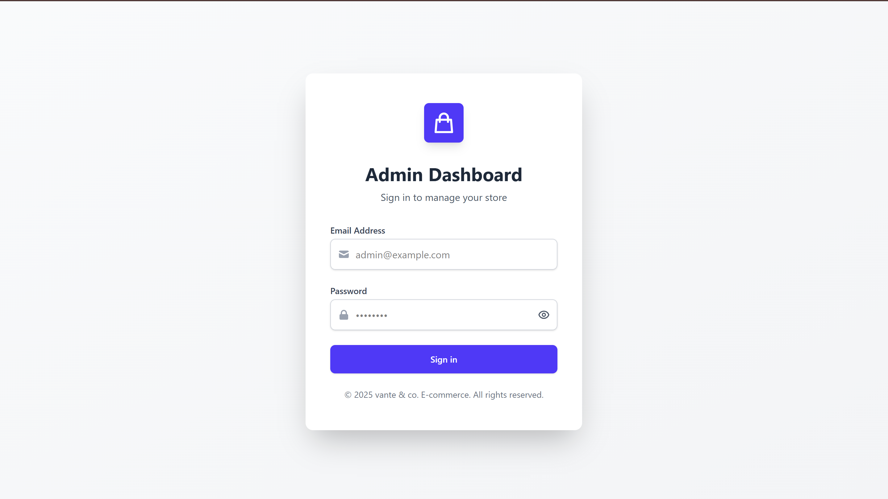
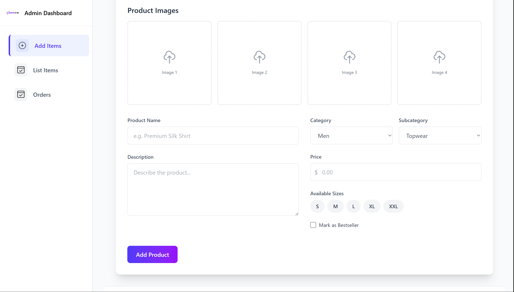
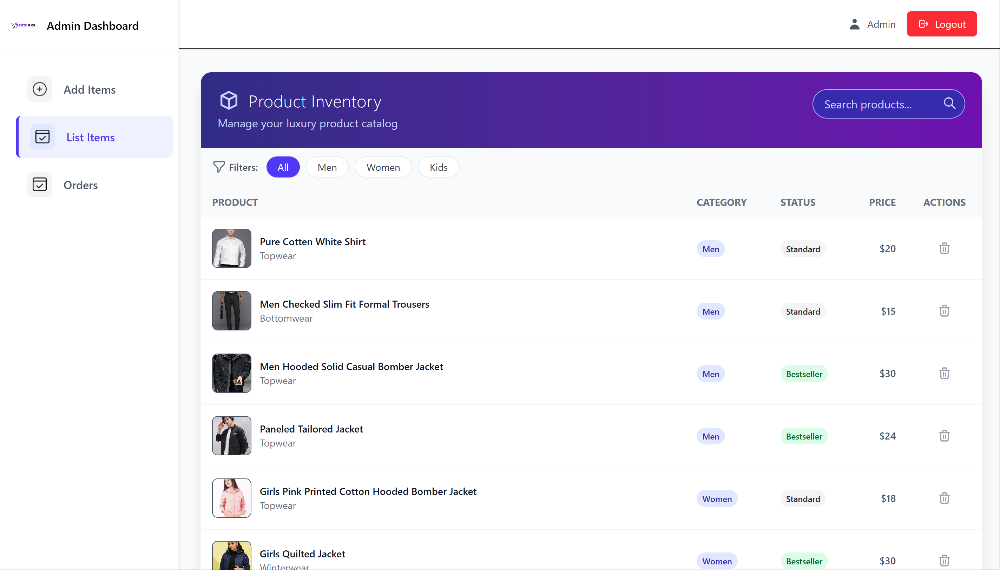
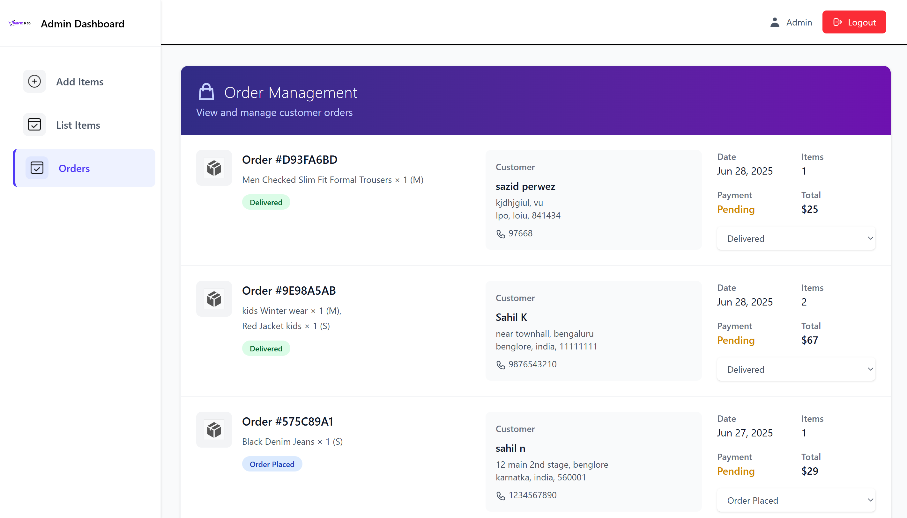
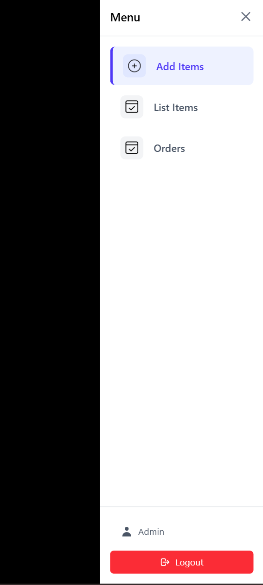
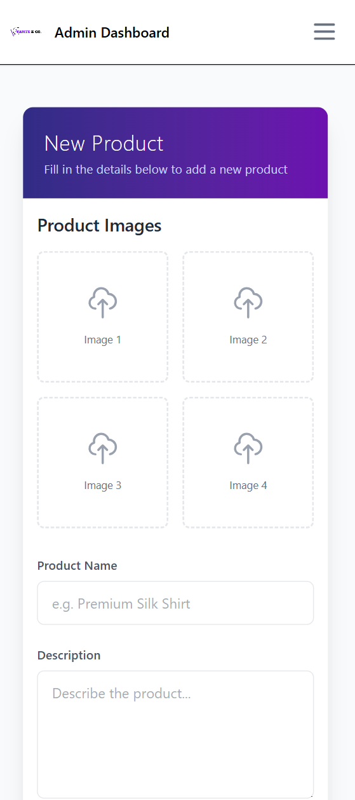
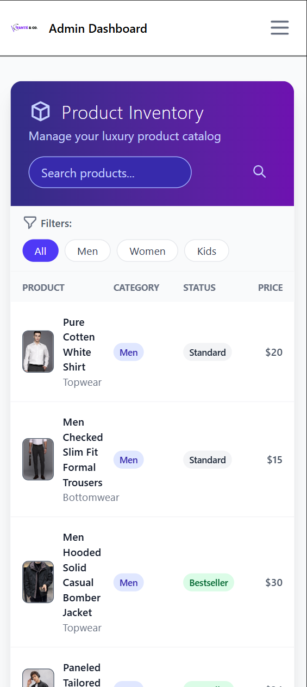
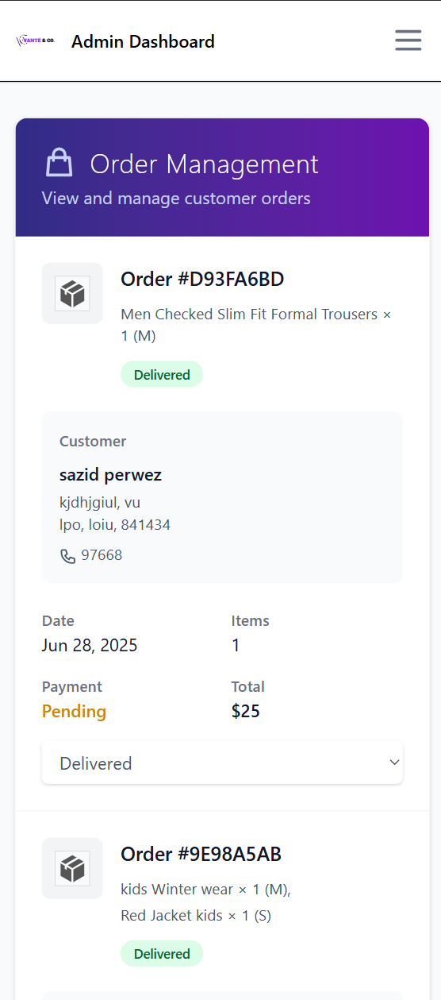

# 🛍️ Vanté & Co - Perfect Store with Luxury

A fully featured **MERN Stack E-commerce Web Application** designed to deliver a luxury shopping experience. It includes both **user-facing** and **admin** functionalities like secure login, product management, smart filtering, and multiple payment options including **Razorpay**, **Stripe**, and **Cash on Delivery**.

---

## 🌐 Live Demo
> https://e-commerce-website-4w6a.vercel.app
## PORT 5000

---

## 📸 Screenshots

### 🏠 Admin Homepage desktop demo
### 🔐 Admin Panel log in page


### 🔐 Admin Panel Item Add Page


### 🔐 Admin Panel Item list 


### 🔐 Admin Panel Order Received Page



### Mobile View of 🔐 Admin Panel
<div align="center">
  
  
  
  
</div>

---

## 📦 Tech Stack

- **Frontend**: React.js, Tailwind CSS, Swiper.js
- **Backend**: Node.js, Express.js
- **Database**: MongoDB (Mongoose)
- **Authentication**: JWT (JSON Web Tokens), Bcrypt
- **Payments**: Razorpay, Stripe, Cash on Delivery
- **Image Handling**: Cloudinary / Local (based on configuration)
- **Deployment**: Vercel / Netlify / Render / Heroku (optional)

---

## ✨ Features

### 👤 User Side
- ✅ Secure User Registration & Login
- ✅ JWT Authentication
- ✅ Product Search Bar
- ✅ Filter by:
  - Category
  - Subcategory
  - Price Range
  - Latest / Relevance
- ✅ View product details
- ✅ Related Product Suggestions
- ✅ Add to Cart
- ✅ Checkout Process
- ✅ Multiple Payment Options:
  - Razorpay
  - Stripe
  - Cash on Delivery
- ✅ View Order History

### 🔐 Admin Panel
- ✅ Secure Admin Login
- ✅ Dashboard with analytics (optional)
- ✅ Manage:
  - Products (CRUD)
  - Categories & Subcategories
  - Orders
  - Users
- ✅ Product Search, Filter, Sort
- ✅ Update Order Status

---

## 📂 Project Structure

```

/client           → React frontend
/server           → Express backend
/models           → Mongoose models
/routes           → API endpoints
/controllers      → Business logic
/context          → React global state (ShopContext)

````

---

## 🔧 Installation

### 🖥️ Clone the repo

```bash
git clone https://github.com/yourusername/vante-co-ecommerce.git
cd vante-co-ecommerce
````

### 🚀 Backend Setup

```bash
cd server
npm install
.env sample 
# - MANGODB_URI=""
# - CLOUDINARY_API_KEY=""
# - CLOUDINARY_SECRET_KEY=""
# - CLOUDINARY_NAME=""
# - JWT_SECRET=""
# - ADMIN_EMAIL=
# - ADMIN_PASSWORD=
# - STRIPE_SECRET_KEY=""
# - STRIPE_PUBLISHABLE_KEY=""
# - RAZORPAY_KEY_SECRET=
# - RAZORPAY_KEY_ID=

npm run dev
```

### 💻 Frontend Setup

```bash
cd client
npm install
npm start
```

---

## 🧪 Testing Accounts

```
User Login:
Email: user@gmail.com  //you can create one too
Password: 12345678 
```

## ✅ Future Improvements

* Product reviews and ratings
* User address book & profile editing
* Email notifications
* Coupon/Discount system
* Wishlist & Recently viewed
* Progressive Web App (PWA)

---

## 📝 License

This project is licensed under the MIT License.

---

## 🤝 Credits

Developed by [Sahil](https://github.com/sahilmd01)
**Project:** *Vanté & Co – Perfect Store with Luxury*

