<div align="center">

# 🛒 **Kcart** - Next-Gen E-commerce Platform


[](https://kcartt.netlify.app)
[](https://github.com/kirtan597/Kcart)
[](https://app.netlify.com/sites/kcartt/deploys)


</div>

## 🌐 **Live Deployment Status**

<div align="center">


### **Production Environment**
[](https://app.netlify.com/sites/kcartt/deploys)
[](https://kcartt.netlify.app)
[](https://kcartt.netlify.app)

**🔗 Live URL**: [`kcartt.netlify.app`](https://kcartt.netlify.app)  
**🚀 CDN**: Netlify Edge Network  
**⚡ Functions**: Serverless Backend  
**🗄️ Database**: MongoDB Atlas  

</div>

## 🎯 **Quick Access**

<div align="center">

| 🎭 **Role** | 📧 **Email** | 🔐 **Password** | 🔗 **Direct Access** |
|-------------|--------------|-----------------|----------------------|
| 👤 **Customer** | `user@gmail.com` | `12345678` | [](https://kcartt.netlify.app/login) |
| 👨‍💼 **Admin** | `admin@kcart.com` | `admin123` | [](https://kcartt.netlify.app/login) |

[](https://kcartt.netlify.app/collection)
[](https://kcartt.netlify.app/dashboard)
[](https://kcartt.netlify.app/place-order)

</div>

## ✨ **Features**

<div align="center">


### **🎯 Core Functionality**

<table>
<tr>
<td align="center" width="25%">
<br>
<strong>🛒 E-commerce</strong><br>
<sub>20+ Products, Cart, Checkout</sub>
</td>
<td align="center" width="25%">
<br>
<strong>🔐 Authentication</strong><br>
<sub>JWT, User/Admin Roles</sub>
</td>
<td align="center" width="25%">
<br>
<strong>📊 Analytics</strong><br>
<sub>Real-time Dashboard</sub>
</td>
<td align="center" width="25%">
<br>
<strong>💳 Payments</strong><br>
<sub>Multiple Gateways</sub>
</td>
</tr>
</table>

[](https://kcartt.netlify.app/collection)
[](https://kcartt.netlify.app/dashboard)
[](https://kcartt.netlify.app/login)

</div>

---

## 🛠️ **Tech Stack**

<div align="center">


<table>
<tr>
<td align="center" width="25%">

<br><strong>React 18</strong>
</td>
<td align="center" width="25%">

<br><strong>Vite 5</strong>
</td>
<td align="center" width="25%">

<br><strong>Tailwind CSS</strong>
</td>
<td align="center" width="25%">

<br><strong>Node.js 18</strong>
</td>
</tr>
<tr>
<td align="center" width="25%">

<br><strong>Express</strong>
</td>
<td align="center" width="25%">

<br><strong>MongoDB</strong>
</td>
<td align="center" width="25%">

<br><strong>Netlify</strong>
</td>
<td align="center" width="25%">

<br><strong>CDN</strong>
</td>
</tr>
</table>


</div>

---

## 📁 **Project Architecture**

```
Kcart/
├── 📱 client/                          # React Frontend
│   ├── 🎨 src/
│   │   ├── 📄 pages/                   # Route components
│   │   │   ├── Home.jsx               # Landing page with hero
│   │   │   ├── Collection.jsx         # Product catalog
│   │   │   ├── Dashboard.jsx          # Admin analytics
│   │   │   ├── PlaceOrder.jsx         # Checkout process
│   │   │   └── AIChat.jsx             # AI integration
│   │   ├── 🧩 components/             # Reusable components
│   │   │   ├── Hero.jsx               # Animated hero section
│   │   │   ├── Navbar.jsx             # Navigation
│   │   │   ├── ProductItem.jsx        # Product cards
│   │   │   └── DashboardComponents/   # Dashboard widgets
│   │   ├── 🔧 services/               # API services
│   │   │   ├── bytezService.js        # AI integration
│   │   │   ├── dashboardService.js    # Analytics
│   │   │   └── userTrackingService.js # User monitoring
│   │   ├── 🎯 context/                # State management
│   │   └── 🎨 assets/                 # Images & icons
│   ├── 🌐 netlify/functions/          # Serverless functions
│   └── 📦 public/                     # Static assets
├── 🖥️ server/                          # Node.js Backend
│   ├── 📊 controllers/                # Business logic
│   ├── 🗃️ models/                     # Database schemas
│   ├── 🛣️ routes/                     # API endpoints
│   ├── 🔧 middleware/                 # Auth & validation
│   └── 📈 data/                       # Seed data
├── 👨‍💼 admin/                          # Admin Panel
│   ├── 📊 Dashboard                   # Admin interface
│   ├── 📦 Product Management          # CRUD operations
│   └── 📋 Order Processing            # Order management
└── 📚 docs/                           # Documentation
    ├── SETUP.md                       # Setup guide
    ├── DASHBOARD_README.md            # Dashboard docs
    └── AI_INTEGRATION_GUIDE.md        # AI features
```

---

## 🚀 **Quick Start Guide**

### Prerequisites
```bash
Node.js >= 18.0.0
npm >= 9.0.0
MongoDB (local or cloud)
```

### 1️⃣ **Clone & Install**
```bash
# Clone the repository
git clone https://github.com/kirtan597/Kcart.git
cd Kcart/E-commerce-website

# Install client dependencies
cd client
npm install

# Install server dependencies
cd ../server
npm install

# Install admin dependencies
cd ../admin
npm install
```

### 2️⃣ **Environment Setup**
```bash
# Server environment (.env)
MONGODB_URI=your_mongodb_connection_string
JWT_SECRET=your_jwt_secret_key
CLOUDINARY_NAME=your_cloudinary_name
CLOUDINARY_API_KEY=your_cloudinary_api_key
CLOUDINARY_API_SECRET=your_cloudinary_api_secret
ADMIN_EMAIL=admin@kcart.com
ADMIN_PASSWORD=admin123

# Client environment (.env)
VITE_BACKEND_URL=https://kcartt.netlify.app/api
VITE_BYTEZ_API_KEY=your_bytez_api_key
```

### 3️⃣ **Database Setup**
```bash
# Seed the database with sample products
cd server
npm run seed
```

### 4️⃣ **Start Development**
```bash
# Terminal 1: Start backend server
cd server
npm run dev

# Terminal 2: Start frontend client
cd client
npm run dev

# Terminal 3: Start admin panel
cd admin
npm run dev
```

### 5️⃣ **Access Applications**

<div align="center">

| Application | Local Development | Live Production |
|-------------|-------------------|-----------------|
| 🌐 **Frontend** | [http://localhost:5173](http://localhost:5173) | [https://kcartt.netlify.app](https://kcartt.netlify.app) |
| 🔧 **Backend API** | [http://localhost:5000](http://localhost:5000) | [https://kcartt.netlify.app/api](https://kcartt.netlify.app/api) |
| 👨‍💼 **Admin Panel** | [http://localhost:5174](http://localhost:5174) | [https://kcartt.netlify.app/admin](https://kcartt.netlify.app/admin) |

</div>

---

## 🎯 **Demo Credentials**

<div align="center">

### 🚀 **Try Live Demo: [kcartt.netlify.app](https://kcartt.netlify.app)**

<table>
<tr>
<th>🎭 Role</th>
<th>📧 Email</th>
<th>🔐 Password</th>
<th>🎯 Access Level</th>
<th>🔗 Direct Link</th>
</tr>
<tr>
<td><strong>👤 Customer</strong></td>
<td><code>user@gmail.com</code></td>
<td><code>12345678</code></td>
<td>Shopping, Cart, Orders</td>
<td><a href="https://kcartt.netlify.app/login">Login Now</a></td>
</tr>
<tr>
<td><strong>👨‍💼 Admin</strong></td>
<td><code>admin@kcart.com</code></td>
<td><code>admin123</code></td>
<td>Dashboard, Analytics, Management</td>
<td><a href="https://kcartt.netlify.app/login">Admin Login</a></td>
</tr>
</table>

### 🌟 **Quick Access Links**
[](https://kcartt.netlify.app/collection)
[](https://kcartt.netlify.app/dashboard)
[](https://kcartt.netlify.app/place-order)

</div>

---

## 📡 **API Documentation**

<div align="center">


### **🌐 Live API**: [`kcartt.netlify.app/api`](https://kcartt.netlify.app/api)

[](https://kcartt.netlify.app/api/product/list)
[](https://kcartt.netlify.app/api)
[](https://kcartt.netlify.app)

</div>

<details>
<summary><strong>🔐 Authentication API</strong></summary>

```javascript
// User Registration
POST /api/user/register
{
  "name": "John Doe",
  "email": "john@example.com", 
  "password": "password123"
}

// User Login
POST /api/user/login
{
  "email": "user@gmail.com",
  "password": "12345678"
}

// Admin Login  
POST /api/user/admin
{
  "email": "admin@kcart.com",
  "password": "admin123"
}
```
</details>

<details>
<summary><strong>🛍️ Products API</strong></summary>

```javascript
// Get All Products
GET /api/product/list
// Returns: 20 products with images, prices, categories

// Get Single Product
GET /api/product/single?id=PRODUCT_ID

// Add Product (Admin Only)
POST /api/product/add
{
  "name": "Product Name",
  "price": 999,
  "category": "Men",
  "sizes": ["S", "M", "L"],
  "image": "product_image.jpg"
}
```
</details>

<details>
<summary><strong>🛒 Cart & Orders API</strong></summary>

```javascript
// Add to Cart
POST /api/cart/add
{
  "itemId": "PRODUCT_ID",
  "size": "M"
}

// Place Order
POST /api/order/place
{
  "items": [...],
  "amount": 1999,
  "address": {...}
}

// Get User Orders
GET /api/order/userorders
```
</details>

### **🧪 Test Live API**
```bash
# Test product listing
curl https://kcartt.netlify.app/api/product/list

# Test user login
curl -X POST https://kcartt.netlify.app/api/user/login \
  -H "Content-Type: application/json" \
  -d '{"email":"user@gmail.com","password":"12345678"}'
```

---

## 🎨 **UI/UX Features**

### 🌟 **Hero Section**
- Animated typewriter effect
- Infinite scrolling product showcase
- Smooth parallax animations
- Interactive hover effects
- Call-to-action button leading to dashboard

### 🎯 **Product Catalog**
- Grid/list view toggle
- Advanced filtering system
- Search with autocomplete
- Sort by price, popularity, rating
- Lazy loading for performance

### 📊 **Dashboard Analytics**
- Real-time sales charts
- User session tracking
- Revenue analytics
- Top products insights
- Geographic user distribution

### 💳 **Payment Integration**
- Google Pay
- Paytm
- PhonePe
- Cash on Delivery
- Secure payment processing

---

## 🤖 **AI Integration**

### Bytez.js SDK Features
```javascript
// AI-powered product recommendations
const recommendations = await bytezService.getRecommendations(userId);

// Intelligent search suggestions
const suggestions = await bytezService.getSearchSuggestions(query);

// Sentiment analysis for reviews
const sentiment = await bytezService.analyzeSentiment(reviewText);

// Smart categorization
const category = await bytezService.categorizeProduct(productData);
```

### AI Dashboard Features
- Predictive analytics
- Customer behavior insights
- Inventory optimization
- Sales forecasting
- Automated product tagging

---

## 📱 **Mobile Responsiveness**

<div align="center">

| Device | Breakpoint | Features |
|--------|------------|----------|
| 📱 Mobile | < 768px | Touch-optimized, Swipe gestures |
| 📱 Tablet | 768px - 1024px | Adaptive layout, Touch & click |
| 🖥️ Desktop | > 1024px | Full features, Hover effects |

</div>

---

## 🚀 **Deployment Architecture**

<div align="center">


### **🌐 Production Infrastructure**

```mermaid
graph TB
    A[👨‍💻 Developer] -->|git push| B[📂 GitHub Repository]
    B -->|Auto Deploy| C[🌐 Netlify CDN]
    C --> D[📱 React Frontend]
    C --> E[⚡ Serverless Functions]
    E --> F[🗄️ MongoDB Atlas]
    E --> G[📸 Cloudinary CDN]
    
    style C fill:#00C7B7
    style D fill:#61DAFB
    style E fill:#FF6B6B
    style F fill:#47A248
    style G fill:#3448C5
```



**🔗 Live URL**: [`kcartt.netlify.app`](https://kcartt.netlify.app)  
**⚡ Edge Locations**: Global CDN  
**🔄 Deploy Time**: ~2 minutes  
**📊 Uptime**: 99.9%  

</div>

### **🔧 Production Configuration**

<details>
<summary><strong>📋 Environment Variables</strong></summary>

```bash
# Netlify Production Environment
NODE_ENV=production
VITE_BACKEND_URL=https://kcartt.netlify.app/api
MONGODB_URI=mongodb+srv://cluster.mongodb.net/kcart
JWT_SECRET=production_jwt_secret_key
CLOUDINARY_NAME=kcart_cloud
CLOUDINARY_API_KEY=your_api_key
CLOUDINARY_API_SECRET=your_api_secret
```
</details>

<details>
<summary><strong>⚙️ Build Configuration</strong></summary>

```toml
# netlify.toml
[build]
  command = "cd client && npm install && npm run build"
  publish = "client/dist"
  functions = "netlify/functions"

[build.environment]
  NODE_VERSION = "18"

[[redirects]]
  from = "/api/*"
  to = "/.netlify/functions/:splat"
  status = 200
```
</details>

### **🔄 CI/CD Pipeline**

```bash
# Automatic deployment on push to main
git add .
git commit -m "feat: new feature"
git push origin main
# ✅ Auto-deploys to https://kcartt.netlify.app
```

---

## ⚡ **Performance Metrics**

<div align="center">


[](https://pagespeed.web.dev/analysis?url=https%3A%2F%2Fkcartt.netlify.app)
[](https://kcartt.netlify.app)
[](https://kcartt.netlify.app)

### **📊 Core Web Vitals**

| Metric | Score | Status |
|--------|-------|--------|
| 🎨 **First Contentful Paint** | < 1.5s | ✅ Excellent |
| 🖼️ **Largest Contentful Paint** | < 2.5s | ✅ Excellent |
| 📏 **Cumulative Layout Shift** | < 0.1 | ✅ Excellent |
| ⚡ **Time to Interactive** | < 3s | ✅ Excellent |
| 🖱️ **First Input Delay** | < 100ms | ✅ Excellent |

</div>

---

## 🔧 **Development Scripts**

```bash
# Client
npm run dev          # Start development server
npm run build        # Build for production
npm run preview      # Preview production build
npm run lint         # Run ESLint

# Server
npm run dev          # Start with nodemon
npm run start        # Start production server
npm run seed         # Seed database
npm run test         # Run tests

# Admin
npm run dev          # Start admin panel
npm run build        # Build admin panel
```

---

## 🧪 **Live Testing & Verification**

<div align="center">

### 🔍 **Test the Live Application**

[](https://kcartt.netlify.app/login)
[](https://kcartt.netlify.app/collection)
[](https://kcartt.netlify.app/dashboard)

</div>

### 🎯 **Testing Scenarios**

<table>
<tr>
<th>🧪 Test Case</th>
<th>🔗 Live Link</th>
<th>📋 Instructions</th>
<th>✅ Expected Result</th>
</tr>
<tr>
<td><strong>User Registration</strong></td>
<td><a href="https://kcartt.netlify.app/login">Test Now</a></td>
<td>Click "Create Account", fill form</td>
<td>Account created, auto-login</td>
</tr>
<tr>
<td><strong>User Login</strong></td>
<td><a href="https://kcartt.netlify.app/login">Test Now</a></td>
<td>Use: user@gmail.com / 12345678</td>
<td>Successful login, redirect to home</td>
</tr>
<tr>
<td><strong>Admin Login</strong></td>
<td><a href="https://kcartt.netlify.app/login">Test Now</a></td>
<td>Use: admin@kcart.com / admin123</td>
<td>Admin access, dashboard available</td>
</tr>
<tr>
<td><strong>Product Browsing</strong></td>
<td><a href="https://kcartt.netlify.app/collection">Test Now</a></td>
<td>Browse products, use filters</td>
<td>20 products displayed, filters work</td>
</tr>
<tr>
<td><strong>Add to Cart</strong></td>
<td><a href="https://kcartt.netlify.app/collection">Test Now</a></td>
<td>Select product, choose size, add</td>
<td>Item added, cart count updates</td>
</tr>
<tr>
<td><strong>Checkout Process</strong></td>
<td><a href="https://kcartt.netlify.app/cart">Test Now</a></td>
<td>Go to cart, proceed to checkout</td>
<td>Order form, payment options</td>
</tr>
<tr>
<td><strong>Admin Dashboard</strong></td>
<td><a href="https://kcartt.netlify.app/dashboard">Test Now</a></td>
<td>Login as admin, view analytics</td>
<td>Charts, user data, order stats</td>
</tr>
</table>

### 🛠️ **API Testing**
```bash
# Test live API endpoints
curl -X GET "https://kcartt.netlify.app/api/product/list"
curl -X POST "https://kcartt.netlify.app/api/user/login" \
  -H "Content-Type: application/json" \
  -d '{"email":"user@gmail.com","password":"12345678"}'
```

---

## 🤝 **Contributing**

We welcome contributions! Please follow these steps:

1. **Fork** the repository
2. **Create** a feature branch (`git checkout -b feature/AmazingFeature`)
3. **Commit** your changes (`git commit -m 'Add some AmazingFeature'`)
4. **Push** to the branch (`git push origin feature/AmazingFeature`)
5. **Open** a Pull Request

### Development Guidelines
- Follow ESLint configuration
- Write meaningful commit messages
- Add tests for new features
- Update documentation
- Ensure responsive design

---

## 📄 **License**

This project is licensed under the **MIT License** - see the [LICENSE](LICENSE) file for details.

---

## 👨‍💻 **Author**

<div align="center">

**Kirtan Panchal**

[](https://github.com/kirtan597)
[](https://linkedin.com/in/kirtan597)
[](mailto:kirtan597@gmail.com)

*Full-Stack Developer | E-commerce Specialist | AI Enthusiast*

</div>

---

## 🙏 **Acknowledgments**

- **React Team** for the amazing framework
- **Tailwind CSS** for the utility-first CSS framework
- **Framer Motion** for smooth animations
- **Cloudinary** for image management
- **MongoDB** for the database solution
- **Netlify** for seamless deployment

---

<div align="center">


## 🌟 **Connect & Support**

[](https://kcartt.netlify.app)
[](https://github.com/kirtan597/Kcart/stargazers)

### **📊 Project Stats**


### **🎯 Quick Demo Access**
[](https://kcartt.netlify.app/login)
[](https://kcartt.netlify.app/login)
[](https://kcartt.netlify.app/collection)

---


### **👨‍💻 Created by Kirtan Panchal**

[](https://github.com/kirtan597)
[](https://linkedin.com/in/kirtan597)
[](mailto:kirtan597@gmail.com)

**Full-Stack Developer | E-commerce Specialist | React Expert**


</div>