# 🛒 **Kcart** - Next-Gen E-commerce Platform

## 🌐 **Live Deployment**

### **Production Environment**

**🔗 Live URL**: [`kcartt.netlify.app`](https://kcartt.netlify.app)  
**🚀 CDN**: Netlify Edge Network  
**⚡ Backend**: Serverless Functions  
**🗄️ Database**: MongoDB Atlas  

## 🎯 **Quick Access**

| 🎭 **Role** | 📧 **Email** | 🔐 **Password** | 🔗 **Direct Access** |
|-------------|--------------|-----------------|----------------------|
| 👤 **Customer** | `user@gmail.com` | `12345678` |  |
| 👨‍💼 **Admin** | `admin@kcart.com` | `admin123` |  |

## ✨ **Features**

### **🎯 Core Functionality**

<table>
<tr>
<td align="center" width="25%">
 
<strong>🛒 E-commerce</strong> 
Product Catalog & Shopping Cart
</td>
<td align="center" width="25%">
 
<strong>🔠Authentication</strong> 
Secure User & Admin Access
</td>
<td align="center" width="25%">
 
<strong>📊 Analytics</strong> 
Real-time Dashboard Insights
</td>
<td align="center" width="25%">
 
<strong>💳 Payments</strong> 
Multiple Payment Gateways
</td>
</tr>
</table>

### **🎨 User Experience**
- Minimalist design with smooth animations
- Responsive layout for all devices
- Advanced product filtering and search
- Real-time cart management
- Seamless checkout process

### **📊 Admin Dashboard**
- Live sales analytics and charts
- User session monitoring
- Order management system
- Product inventory control
- AI-powered insights

---

## 🛠️ **Tech Stack**

<table>
<tr>
<td align="center" width="25%">

 <strong>React 18</strong>
</td>
<td align="center" width="25%">

 <strong>Vite 5</strong>
</td>
<td align="center" width="25%">

 <strong>Tailwind CSS</strong>
</td>
<td align="center" width="25%">

 <strong>Node.js 18</strong>
</td>
</tr>
<tr>
<td align="center" width="25%">

 <strong>Express</strong>
</td>
<td align="center" width="25%">

 <strong>MongoDB</strong>
</td>
<td align="center" width="25%">

 <strong>Netlify</strong>
</td>
<td align="center" width="25%">

 <strong>CDN</strong>
</td>
</tr>
</table>

---

## 🚀 **Deployment Architecture**

### **🌐 Production Infrastructure**

```mermaid
graph TB
    A[👨‍💻 Developer] -->|git push| B[📂 GitHub Repository]
    B -->|Auto Deploy| C[🌐 Netlify CDN]
    C --> D[📱 React Frontend]
    C --> E[⚡ Serverless Functions]
    E --> F[🗄️ MongoDB Atlas]
    E --> G[📸 Cloudinary CDN]
    
    style C fill:#00C7B7
    style D fill:#61DAFB
    style E fill:#FF6B6B
    style F fill:#47A248
    style G fill:#3448C5
```

**🔗 Live URL**: [`kcartt.netlify.app`](https://kcartt.netlify.app)  
**⚡ Edge Locations**: Global CDN  
**🔄 Deploy Time**: ~2 minutes  
**📊 Uptime**: 99.9%  

---

## 📡 **API Documentation**

### **🌐 Live API**: [`kcartt.netlify.app/api`](https://kcartt.netlify.app/api)

### **Available Endpoints**
- 🔐 Authentication (Login, Register, Admin)
- 🛍️ Products (List, Single, Add, Remove)
- 🛒 Cart (Add, Update, Get)
- 📦 Orders (Place, List, Status)

---

## ⚡ **Performance Metrics**

### **📊 Core Web Vitals**

| Metric | Score | Status |
|--------|-------|--------|
| 🎨 **First Contentful Paint** | < 1.5s | ✅ Excellent |
| 🖼️ **Largest Contentful Paint** | < 2.5s | ✅ Excellent |
| 📏 **Cumulative Layout Shift** | < 0.1 | ✅ Excellent |
| ⚡ **Time to Interactive** | < 3s | ✅ Excellent |
| 🖱️ **First Input Delay** | < 100ms | ✅ Excellent |

---

## 🧪 **Live Testing**

### 🔍 **Test the Live Application**

### 🎯 **Testing Scenarios**

<table>
<tr>
<th>🧪 Test Case</th>
<th>🔗 Live Link</th>
<th>📋 Instructions</th>
<th>✅ Expected Result</th>
</tr>
<tr>
<td><strong>User Registration</strong></td>
<td><a href="https://kcartt.netlify.app/login">Test Now</a></td>
<td>Create new account</td>
<td>Account created, auto-login</td>
</tr>
<tr>
<td><strong>User Login</strong></td>
<td><a href="https://kcartt.netlify.app/login">Test Now</a></td>
<td>Use demo credentials</td>
<td>Successful login</td>
</tr>
<tr>
<td><strong>Admin Login</strong></td>
<td><a href="https://kcartt.netlify.app/login">Test Now</a></td>
<td>Use admin credentials</td>
<td>Admin dashboard access</td>
</tr>
<tr>
<td><strong>Product Browsing</strong></td>
<td><a href="https://kcartt.netlify.app/collection">Test Now</a></td>
<td>Browse and filter products</td>
<td>20 products displayed</td>
</tr>
<tr>
<td><strong>Add to Cart</strong></td>
<td><a href="https://kcartt.netlify.app/collection">Test Now</a></td>
<td>Select product and size</td>
<td>Cart updates</td>
</tr>
<tr>
<td><strong>Checkout</strong></td>
<td><a href="https://kcartt.netlify.app/cart">Test Now</a></td>
<td>Proceed to checkout</td>
<td>Payment options shown</td>
</tr>
<tr>
<td><strong>Admin Dashboard</strong></td>
<td><a href="https://kcartt.netlify.app/dashboard">Test Now</a></td>
<td>View analytics</td>
<td>Charts and data displayed</td>
</tr>
</table>

---

## 🤝 **Contributing**

Contributions are welcome! Feel free to:
- Fork the repository
- Create a feature branch
- Submit a pull request

---

## 📄 **License**

This project is licensed under the **MIT License**.

---

## 🌟 **Connect & Support**

### **📊 Project Stats**

### **🎯 Quick Demo Access**

---

### **👨‍💻 Created by Kirtan Panchal**

**Full-Stack Developer | E-commerce Specialist | React Expert**

